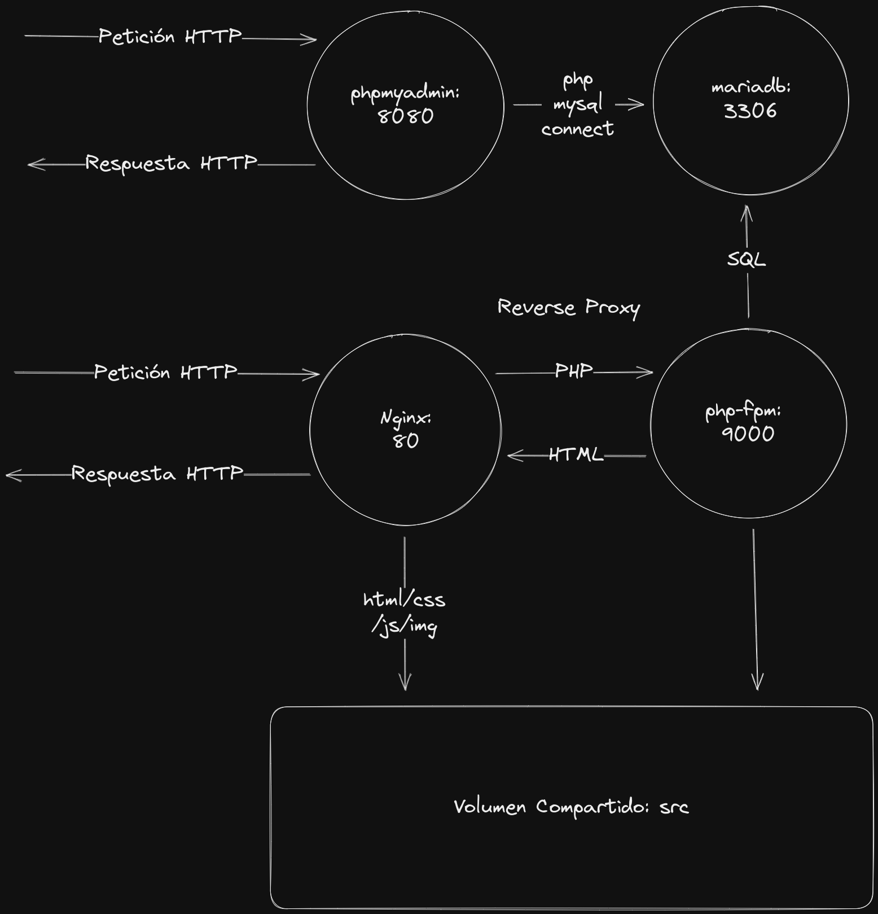

# Entorno de Ejecución de Aplicaciones PHP con Docker y Docker Compose Seguras

## Instalación
* Deberás tener instalado:
  * Docker
  * Docker Compose

## Inicialización del Entorno
```shell
./pdd init
```

## Lanzamiento del Entorno
- Usando el comando personalizado: 
```shell
./pdd start
```
- Con el Docker compose: 
```shell
docker compose up -d --force-recreate
```

## URLS de acceso:
* Entorno Varnish: http://localhost:80 (deberías ver el phpinfo.php)
* Entorno Nginx-PHP: http://localhost:81 (deberías ver el phpinfo.php)
* Entorno PHPMyAdmin: http://localhost:8081 (usuario: test/test)

## Instalación de dependencias composer
```shell
 docker compose exec php composer install
```

## Parada del Entorno
- Usando el comando personalizado:
```shell
./pdd stop
```
- Con el Docker compose: 
```shell
docker compose down
```

## Carpetas Importantes:
* src: código php
* conf: fichero de configuración de nginx y PHP
* db-data: volumen de datos de BBDD

## Fichero Dockerfile
Este fichero permite generar una imagen docker para crear 
un entorno PHP-FPM con la versión de PHP específica.
Permite también elegir las extensiones de PHP que necesitemos.
La primera vez que carguen los contenedores con el docker compose, 
Creará la imagen de PHP-FPM, por lo que el primer arranque tarará 
un poco más que el resto de veces

